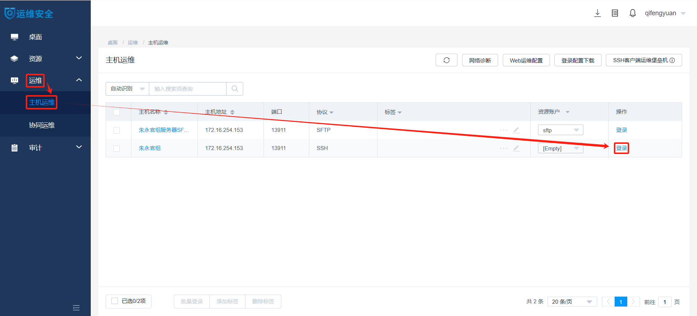
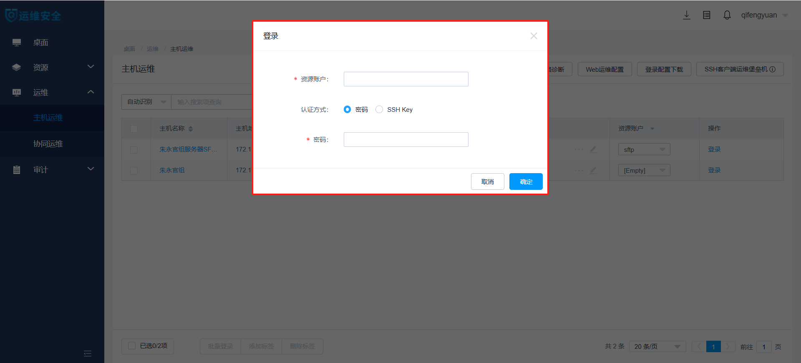
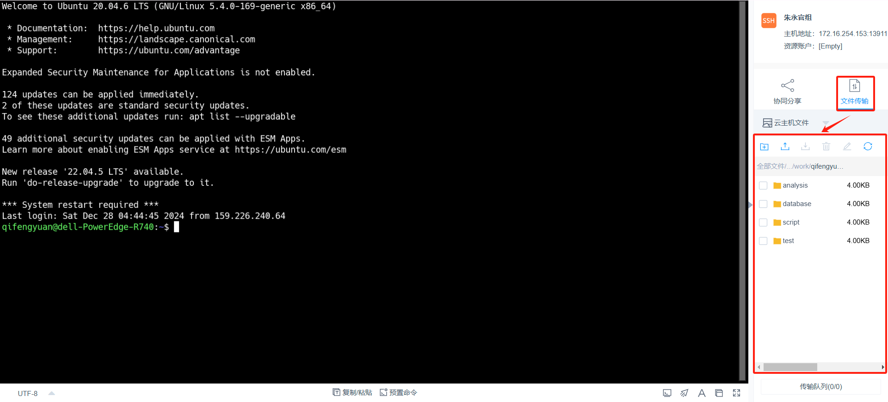
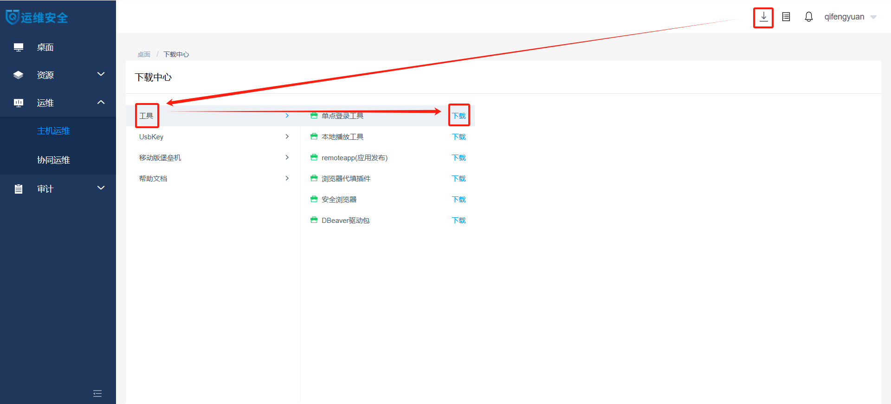
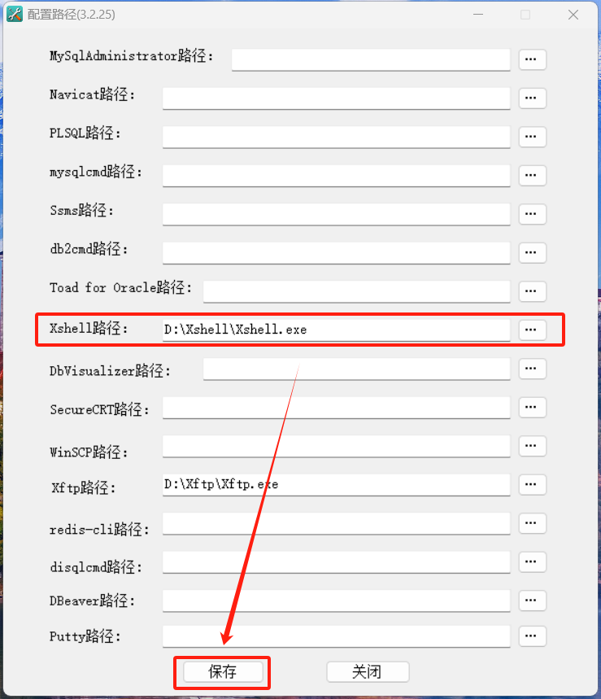
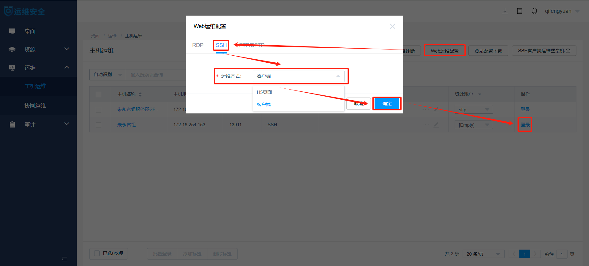
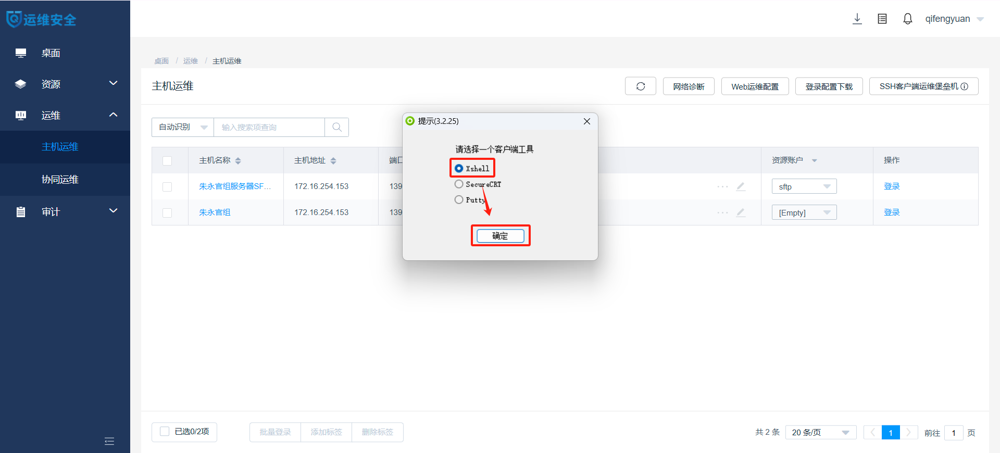
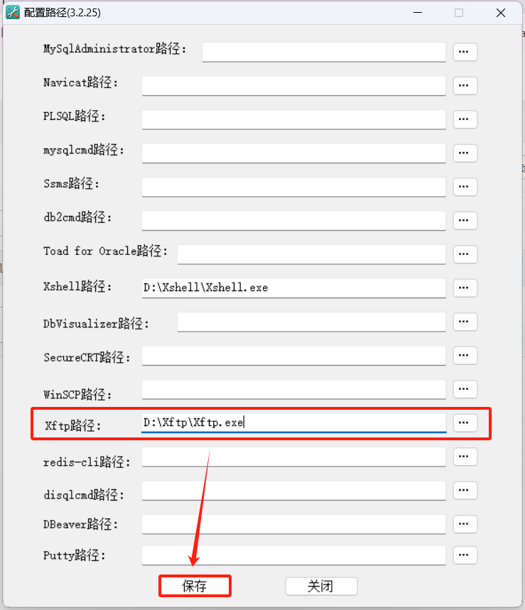
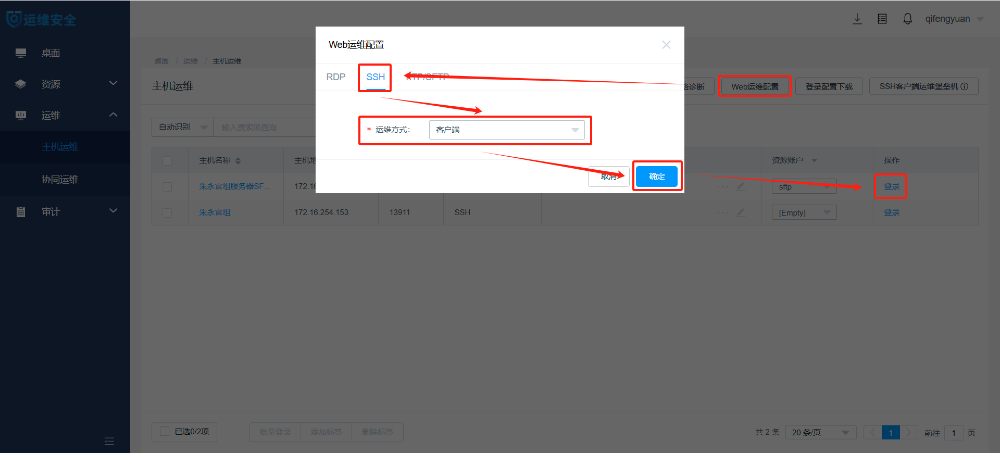
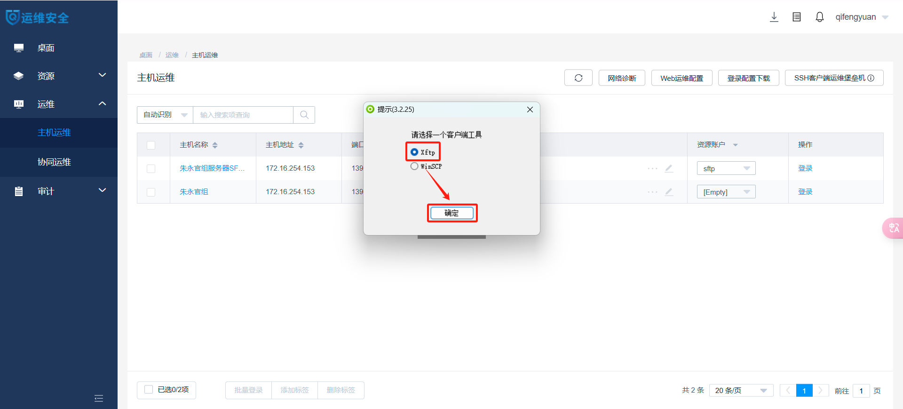

# ZLab服务器用户手册
> 文档维护：亓逢源
## 服务器概况
### 基本信息
服务器型号为戴尔PowerEdge R740，运行在Ubuntu 20.04.6 LTS操作系统上，内核版本为5.4.0-169-generic。服务器的硬件架构为x86_64，支持32位和64位操作模式。
### 存储空间
服务器中装有两个数据库存储卷：/dev/sdc(**32TB**)和/dev/sda1(**10TB**)，分别挂载于`/database`和`/database_new`。
### 计算资源数
服务器配备了两颗Intel Xeon Gold 6230处理器，每颗处理器拥有20个物理核心并通过超线程技术总计提供**80**个逻辑CPU。服务器拥有**1TB**的物理内存。
## 使用指南
### 登录运维审计系统并访问服务器
1. 使用**运维审计账号**登录[运维审计系统](https://159.226.240.64/#/login)（**运维审计账号**与**服务器账号**的区别详见[注意事项](#注意事项)）。


2. 在运维审计系统桌面中，依次点击“运维”、“主机运维”和“登录”，进入服务器访问界面。



3. 使用**服务器账号**访问服务器，即可进入网页端的命令行界面。



### 在网页端进行数据传输
1. 在网页端的命令行界面中点击“文件传输”，即可在路径列表中依次进入**工作目录**，进行文件的下载和上传。



### （可选）在Xshell客户端访问服务器
1. 在任意运维审计系统页面中，依次点击“下载”、“工具”和“单点登录工具”，下载并运行SsoDBSettings的安装程序SsoTool.msi。



2. 打开SsoDBSettings，将Xshell.exe的绝对路径写入指定位置后保存。



3. 在运维审计系统的“主机运维”页面中，依次点击“Web运维配置”和“SSH”，在“运维方式”栏选择“客户端”后点击“确定”，最后点击“登录”。



4. 使用**服务器账号**访问服务器，在弹出的“提示”窗口中选择“Xshell”后点击“确定”，即可进入Xshell客户端的命令行界面。



### （可选）在Xftp客户端进行数据传输
1. 在任意运维审计系统页面中，依次点击“下载”、“工具”和“单点登录工具”，下载并运行SsoDBSettings的安装程序SsoTool.msi。


2. 打开SsoDBSettings，将Xftp.exe的绝对路径写入指定位置后保存。



3. 在运维审计系统的“主机运维”页面中，依次点击“Web运维配置”和“SSH”，在“运维方式”栏选择“客户端”后点击“确定”，最后点击“登录”（“登录”位置与在Xshell客户端访问服务器的“登录”位置不同）。



4. 在弹出的“提示”窗口中选择“Xftp”后点击“确定”，即可进入Xftp客户端的命令行界面，进行文件的下载和上传（在进行文件的下载和上传之前请先认真阅读[注意事项](#注意事项)）。



### 配置分析环境
1. 将miniconda3安装到**工作目录**。注意，miniconda3的默认安装位置为**主目录**而非**工作目录**（**主目录**与**工作目录**的区别详见[注意事项](#注意事项)），请在安装过程中进行手动修改。请点击[此处](https://blog.csdn.net/suiyueruge1314/article/details/126705416)查看本步骤的参考流程。
```
bash /database/public/software/Miniconda3-latest-Linux-x86_64.sh #若想下载最新版本请访问https://docs.anaconda.com/miniconda/
```
2. 在miniconda3中配置国内镜像源。
```
conda config --add channels https://mirrors.tuna.tsinghua.edu.cn/anaconda/pkgs/free/
conda config --add channels https://mirrors.tuna.tsinghua.edu.cn/anaconda/pkgs/main/
conda config --add channels https://mirrors.tuna.tsinghua.edu.cn/anaconda/pkgs/r/
conda config --add channels https://mirrors.tuna.tsinghua.edu.cn/anaconda/pkgs/pro/
conda config --add channels https://mirrors.tuna.tsinghua.edu.cn/anaconda/pkgs/msys2/
conda config --add channels https://mirrors.tuna.tsinghua.edu.cn/anaconda/cloud/bioconda/
conda config --add channels https://mirrors.tuna.tsinghua.edu.cn/anaconda/cloud/conda-forge/
conda config --add channels https://mirrors.tuna.tsinghua.edu.cn/anaconda/cloud/qiime2
conda config --add channels https://mirrors.tuna.tsinghua.edu.cn/anaconda/cloud/biobakery
conda config --set show_channel_urls yes
```
3. （可选）创建生信分析环境并安装相应分析软件。点击此处查看本步骤参考教程。
```
conda create --name fastp #创建一个名为fastp的分析环境
conda activate fastp # 进入名为fastp的分析环境
conda install fastp # 安装名为fastp的分析软件
```
4. 调用自建或[公共]分析环境(#分析环境)。注意，请在调用公共分析环境时使用绝对路径。
```
conda activate fastp #调用自建分析环境
conda activate /database/public/software/miniconda3/envs/fastp #调用公共分析环境
```
## 注意事项
- 正确区分**运维审计账号**与**服务器账号**。**运维审计账号**是“服务器运维系统申请表”中“运维审计账号”栏中内容，用于登录运维审计系统；**服务器账号**是管理员分配给每位用户的，用于在运维审计系统内访问服务器的账号。
- 正确区分**工作目录**与**主目录**。**工作目录**是管理员分配给每位用户的专属目录，用户可点击[此处](table/用户名录.CSV)查看；**主目录**是用于存储用户配置文件的目录，可使用命令`echo $HOME`查看。受限于服务器的存储空间分配，用户仅能在**工作目录**下进行包括**配置分析环境**在内的所有生物信息分析工作，仅能在**主目录**下进行用户配置文件的修改。
- 通过Xftp访问服务器文件目录的是用户名为sftp的公共**服务器账号**，该账号与所有服务器用户共属于community组。因此，通过Xftp进行文件的下载时需关注被下载文件的权限设置能否被同组的其他用户读取。此外，请不要在Xftp客户端内进行任何除了数据传输之外的操作（特别是文件夹的创建），这会导致新建文件夹的用户权限错误。请点击[此处](https://www.runoob.com/linux/linux-file-attr-permission.html)查看关于文件权限设置的说明文档。
## 公共资源
### 分析环境
### 数据库
